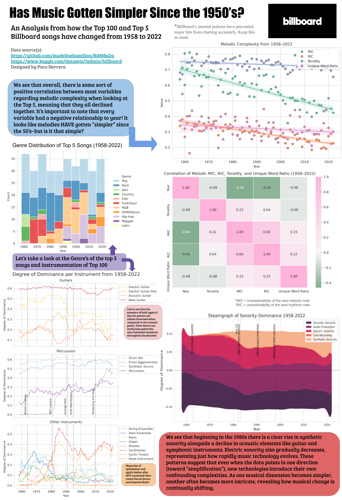

### Description of the Final Product

The final product is a collection of a stacked barchart, a paired scatterplot with regression lines and heatmap, multiple line graphs of instrumentation, and a steamgraph of sonority. The goal is for the reader to acknowledge the paired plot and realize that music has "gotten simpler" since the 1950's, but then to utilize the remaining figures to think critically about that initial claim. When looking at the other figures, the reader should realize that there are MANY factors to consider (significantly more than what I mentioned in the infographic), and that the measurement used is just one of many.

___
### Title of Final Product:
Has Music Gotten Simpler Since the 1950’s?

___
### Image of Final Product:

___
## Resource Manifest

| Name | Type | Description | Link |
|------|------|-------------|------|
| bimmuda_genre | .csv file | Top 5 Songs Per Year + metadata | `bimmuda_genre.csv` |
| bimmuda_per_melody_full | .csv file | Song IDs + Tonal metadata | `bimmuda_per_melody_full.csv` |
| bimmuda_per_song_full | .csv file | Top 5 Songs Per Year + Melodic metadata | `bimmuda_per_song_full.csv` |
| hot100_charts | .tsv file | Top 100 Weekly Charts Data | `hot100_charts.tsv` |
| mgphot_gene_values | .tsv file | Gene Values (Metadata) of Top 100 | `mgphot_gene_values.tsv` |
| mgphot_genes | .tsv file | Descriptions of each gene | `mgphot_genes.tsv` |
| SONGS_FULL | .csv file | My own re-organization of the BiMMuDa data| `SONGS_FULL.csv` |
| BiMMuDa GitHub | External Link | BiMMuDa GitHub Repo | `https://github.com/madelinehamilton/BiMMuDa/` |
| BiMMuDa Research | External Link | Research Paper for BiMMuDa | `https://transactions.ismir.net/articles/10.5334/tismir.168#12-the-billboard-charts` |
| MGPHot GitHub | External Link | MGPHot GitbHub Repo | `https://github.com/utdata/rwd-billboard-data` |
| BMGPHot Research| External Link | Research Paper for MGPHot | `https://transactions.ismir.net/articles/10.5334/tismir.236` |
| Notebook 1 | Jupyter Notebook | Establishes the data | `Notebook1_est_data.ipynb` |
| Notebook 2.1 | Jupyter Notebook | Barchart, Linegraphs, Widget creation | `EDA_I.ipynb` |
| Notebook 2.2 | Jupyter Notebook | Heatmap creation | `EDA_II.ipynb` |
| Notebook 2.3 | Jupyter Notebook | Finalizing and Revising all figures | `EDA_III.ipynb` |
| Notebook 3 | Jupyter Notebook | Final Production Descriptions | `Notebook3_final_prod.ipynb` |
| Billboard Starter Notebook| External Link | Foundation for Widget | `https://www.kaggle.com/code/ludmin/billboard-s-starter-notebook` |
| Steamgraph with Python and Matplotlib| External Link | Foundation for Steamgraph | `https://python-graph-gallery.com/streamchart-basic-matplotlib/` |
